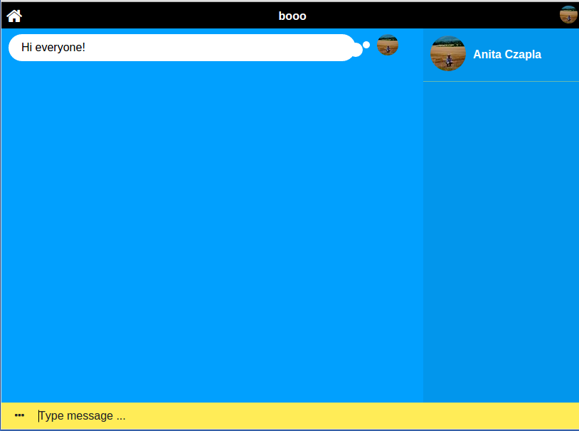
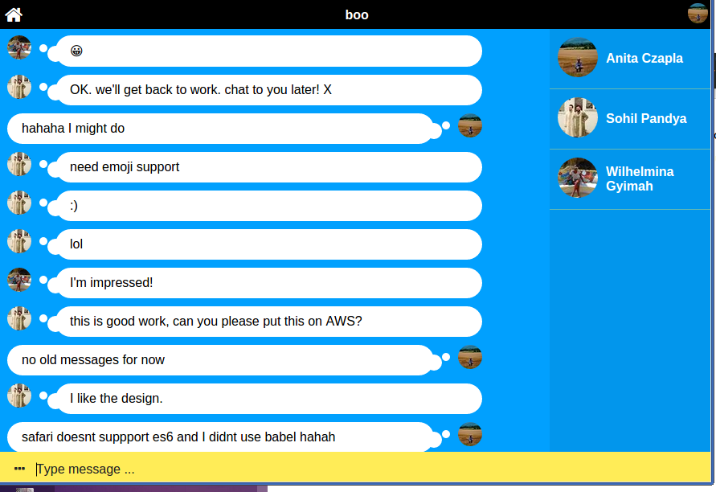

# Bubbles

[](https://travis-ci.org/heron2014/Bubbles)
[](https://codeclimate.com/github/heron2014/Bubbles)
[](https://codeclimate.com/github/heron2014/Bubbles/coverage)
[](https://david-dm.org/heron2014/Bubbles)
[](https://david-dm.org/heron2014/Bubbles#info=devDependencies)
[](https://codecrystal.herokuapp.com/graph/heron2014/Bubbles/master)

## What is Bubbles?

Chat application using Redis , Socket.io , Hapi

You can try it out : https://bubbles-chat.herokuapp.com (best experience in Chrome)





## Why are we building Bubbles?

We want to go back to the 90s and recreate some of the retro chat rooms from our youth. The aim is to incorporate private chat as well. User will be able to create a new chat room to talk about whatever boy band they want.

## How?

This project will be fully tested and completed using TDD. No code will be written unless the test for it already exists. The project duration is 5 days.

#### Day 1

+ [x] Set up code quality assurance (Travis, Code Climate, Coverage, Code Crystal)
+ [x] Wireframes
+ [x] Set up basic server
+ [x] Routes and Handlers for basic layout

#### Day 2

+ [x] Set up socket.io
+ [x] Create Redis database
+ [x] Create default chat room
+ [x] Identification of users

#### Day 3

+ [x] Create new chat room by the user

#### Day 4

+ [ ] Private chat

#### Day 5

+ [x] Styling
+ [x] Push to Heroku

## How to run Bubbles?

This will be live on Heroku at the end of project but for now you can git clone this repo and run it locally. You will have to define an environment variables:

``` DBURI=mongodb://your_mongo_lab_db
SESSION_SECRET=some_session_secret
FB_CLIENT_ID=get_id_from_developers_facebook
FB_CLIENT_SECRET=get_id_from_developers_facebook
DEVELOPMENT=http://127.0.0.1:6379
#REDISCLOUD_URL=redis://your_redis_db_from_heroku ```

##### Create app in https://developers.facebook.com/

Steps:

- settings/basic add in Website/site url: http://localhost:3000
- Facebook Login add in Valid OAuth redirect URIs: http://localhost:3000 (bell is taking care of your redirect callback)


##### Create remote database

Create remote database in [mongolab](https://mlab.com/).

- crate new database
- pick amazon services
- check sanbox free
- named your database

Then add database. Copy the url which look like this:

```
mongodb://<dbuser>:<dbuserpassword>@ds888888.mlab.com:99999/someNameOfYourDatabase
```

##### Add redis remote db in heroku

Don't forget to:
``` npm install ```

Then visit http://localhost:3000 in your favourite browser.


If you want to test:
``` npm test ```
